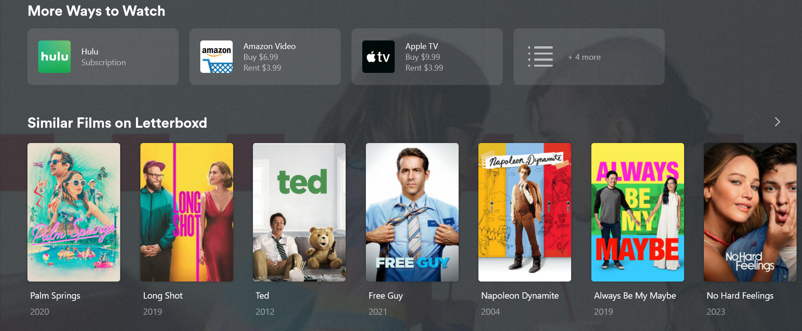

# Pseuplex

A middleware proxy for the plex server API. This sits in between the plex client and the plex server, forwarding requests and modifying responses to add some extra features.

Inspired by [Replex](https://github.com/lostb1t/replex)

This project is still very much a WIP and it is not recommended to enable this for remote access yet.

## Features

- ### Similar Films on Letterboxd

	Instead of only showing related movies from your server, you can show the list of similar movies from letterboxd

	

	For movies that aren't available on your server, the "unavailable" status will appear on the film page.

	

	**Note**: The unavailable status will not show on the Roku client or any other client that doesn't subscribe to the plex server websocket.

- ### Letterboxd Friends Activity

	Activity from your letterboxd friends can be displayed on the server home page. Different users on your server can be configured to display their own friend feeds.

	

- ### Letterboxd Friends Reviews

	Reviews from your letterboxd friends can be included alongside the RottenTomatoes reviews

	

## Setup

### SSL

You must use your own SSL certificate for your plex server in order for pseuplex to modify requests over HTTPS. Otherwise, pseuplex will only work over HTTP, or it will fallback to the plex server's true address instead of the proxy address.

### Configuration

Create a `config.json` file with the following structure, and fill in the configuration for your setup:

```json
{
	"port": 32401,
	"plex": {
		"host": "http://127.0.0.1",
		"port": "32400",
		"token": "<PLEX API TOKEN>"
	},
	"ssl": {
		"keyPath": "/etc/pseuplex/ssl_cert.key",
		"certPath": "/etc/pseuplex/ssl_cert.crt"
	},
	"perUser": {
		"yourplexuseremail@example.com": {
			"letterboxdUsername": "<LETTERBOXD USERNAME>"
		}
	}
}
```

- **port**: The port that Pseuplex will run on
- **plex.port**: The port of your plex server (Usually 32400)
- **plex.host**: The url of your plex server, not including the port.
- **plex.token**: The plex API token of the server owner.
- **ssl.keyPath**: The path to your SSL private key
- **ssl.certPath**: The path to your SSL certificate
- **perUser**: A map of settings to configure for each user on your server. The entry keys are the plex email for each the user.
	- **letterboxdUsername**: The letterboxd username for this user

### Network Settings

Once you have generated your own SSL certificate, configure your server's [Network settings](https://support.plex.tv/articles/200430283-network/) to use it.


In the *Custom server access URLs* field, put the URLs of your pseuplex server, separated by commas.


Ensure *Enable local network discovery (GDM)* and *Enable Relay* are both unchecked, and then the changes to your server's network settings.

At this point, your plex server might no longer show up on *app.plex.tv*

### Remote Access

If you are using remote access, you'll need to port forward your pseuplex proxy instead of your plex server.

### Running

To run, cd into this repo's folder in terminal and run the following commands, replacing the config.json path with your own:

```sh
npm install
npm start -- --config="/path/to/config.json"
```
